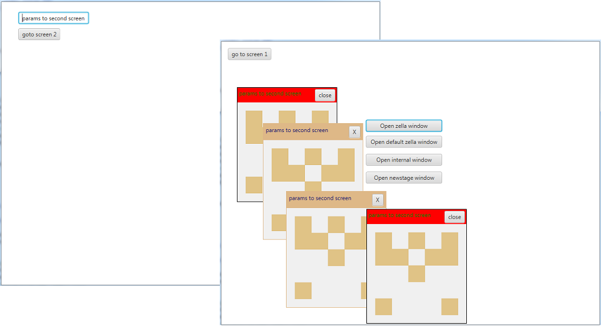

javafx-MultipleScreens-framework
====================
This framework allows you to managed multiple screens. 
  
Also you can use it for kiosk application. Sample - MDI application - shows how switches between scenes, pass parameters to another screen, destroing resources on closing screen and showing internal windows from jfxtras library.  

